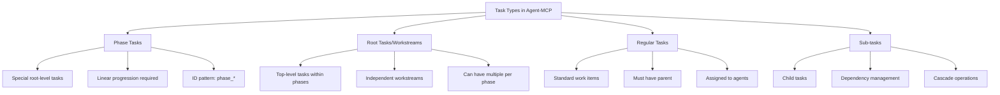
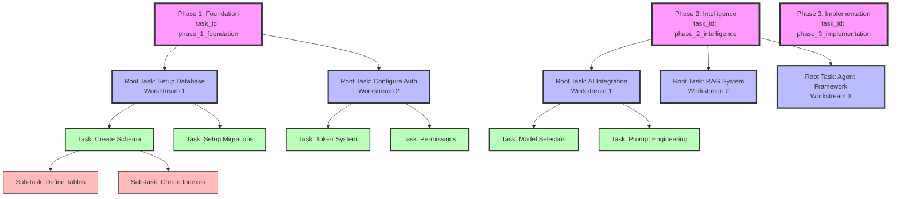
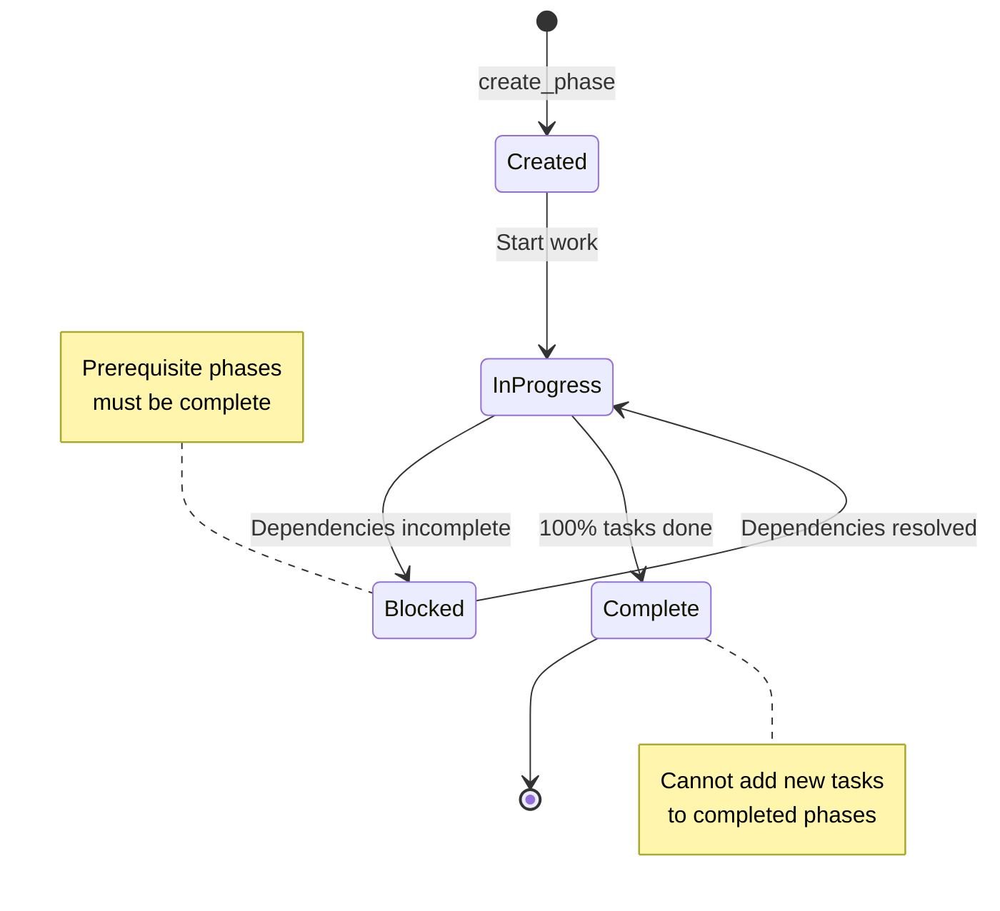
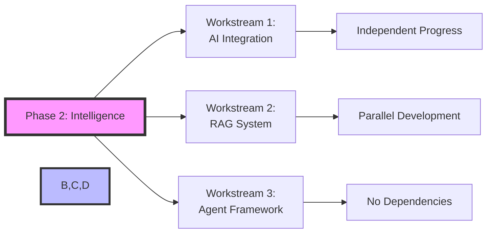
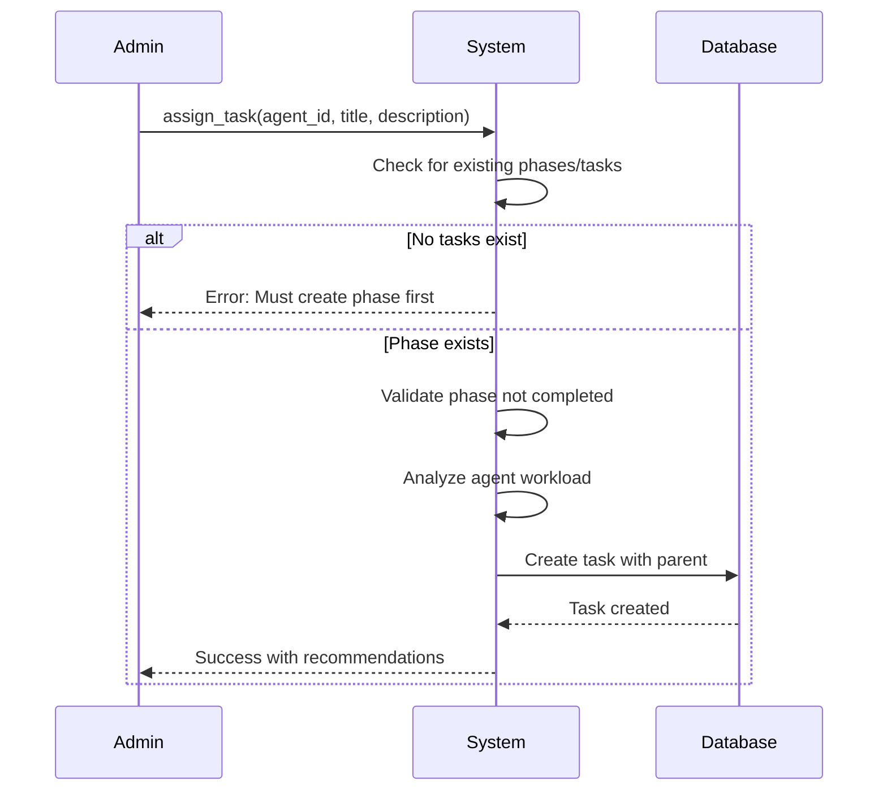
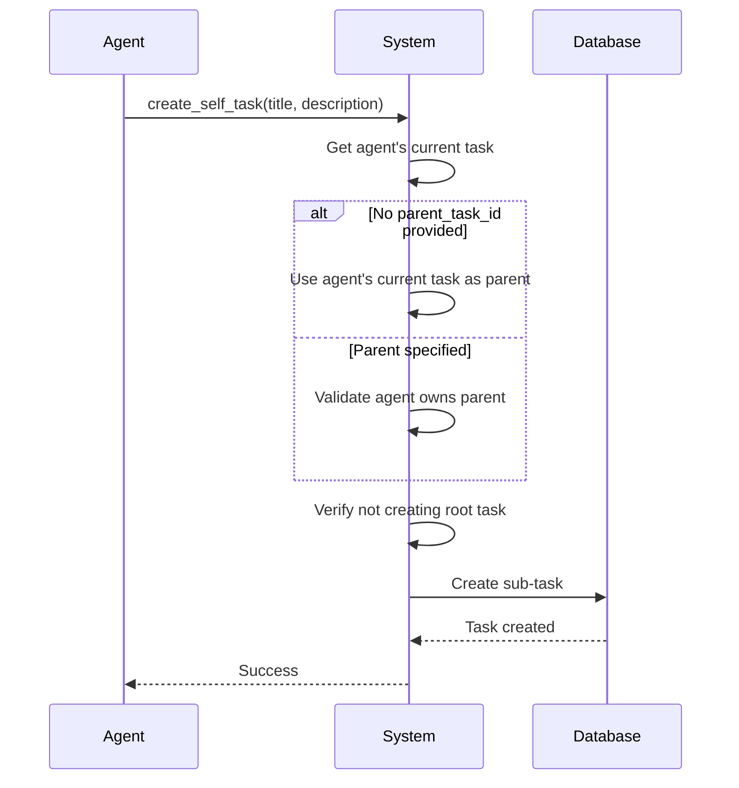
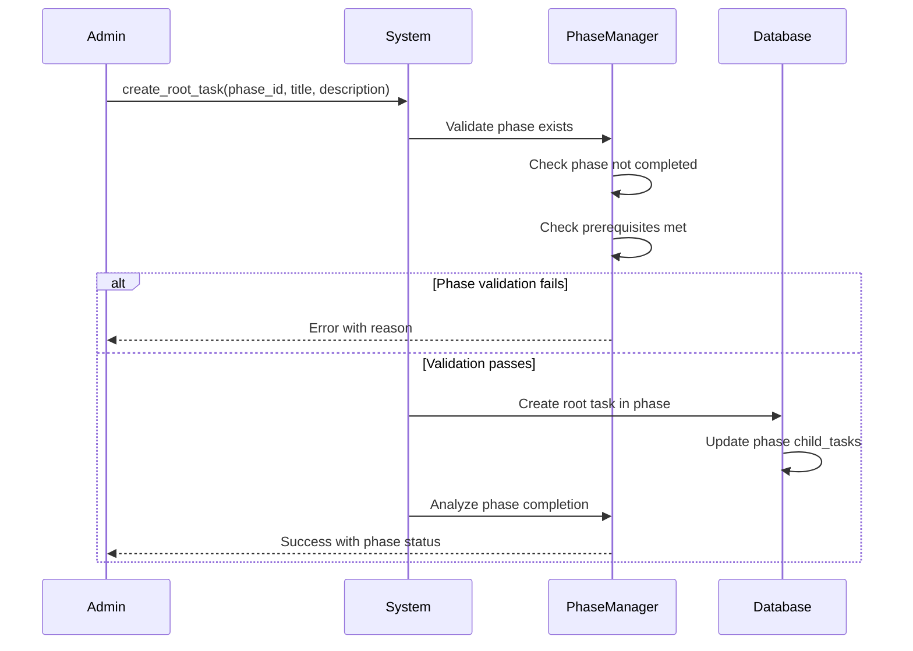
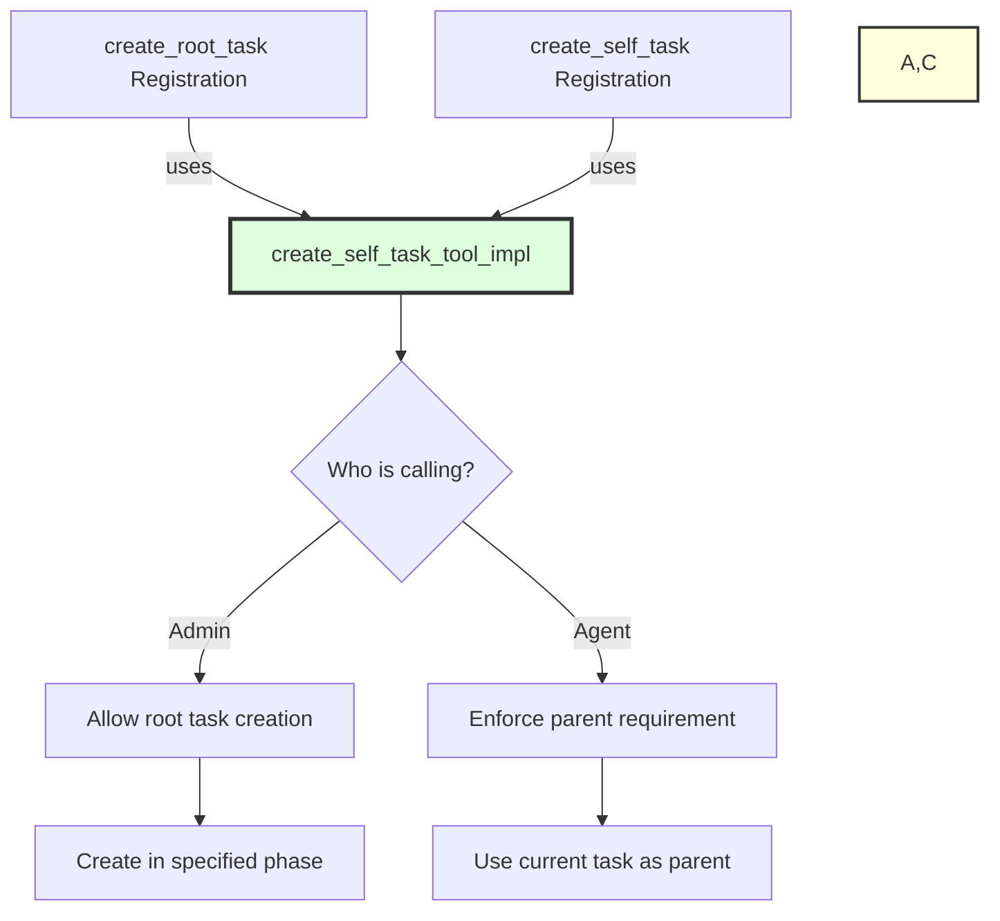
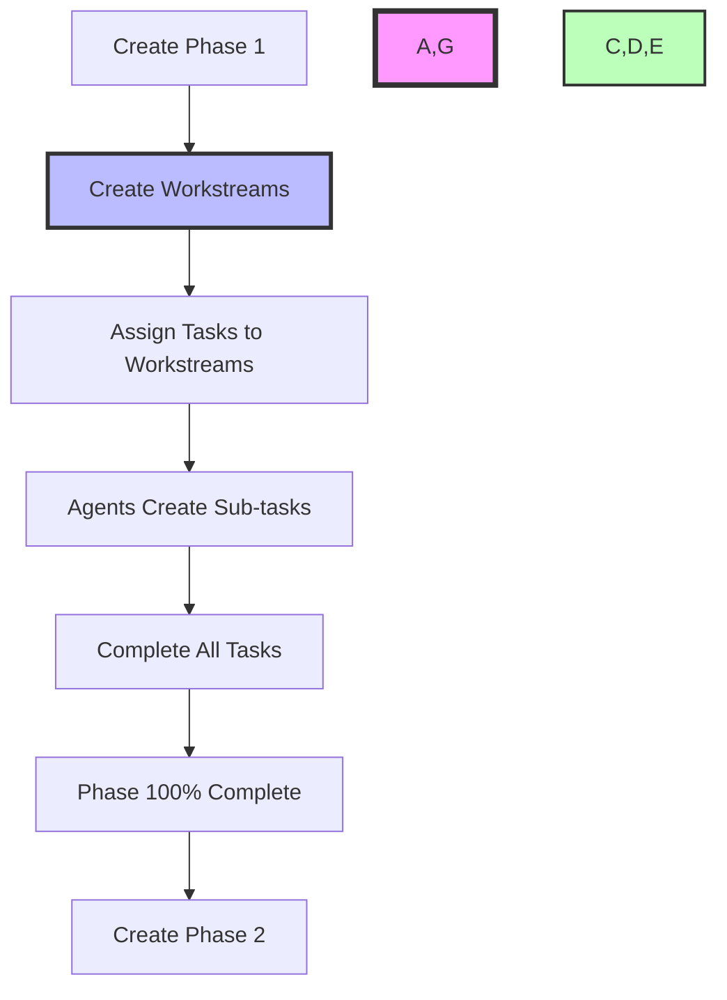

# Agent-MCP Task Hierarchy System: Complete Guide

## Table of Contents
1. [Overview](#overview)
2. [Core Concepts](#core-concepts)
3. [Task Hierarchy Structure](#task-hierarchy-structure)
4. [Phase System](#phase-system)
5. [Root Tasks and Workstreams](#root-tasks-and-workstreams)
6. [Task Creation Workflows](#task-creation-workflows)
7. [Tool Usage Patterns](#tool-usage-patterns)
8. [Implementation Details](#implementation-details)
9. [Best Practices](#best-practices)

## Overview

The Agent-MCP task hierarchy system is designed around the principle of **minimal tools with maximum power**. Rather than having many specialized tools, the system uses a few powerful, flexible tools that can handle multiple scenarios through parameter variations and intelligent behavior.

### Philosophy: RGB Creates the Rainbow
Just as Red, Green, and Blue can create all colors, Agent-MCP uses a minimal set of powerful tools to create complex task hierarchies and workflows.

## Core Concepts

### 1. Task Types



### 2. Hierarchy Rules

1. **Phase-Based Workflow**: When phases exist, all tasks must belong to a phase
2. **Linear Phase Progression**: Phases must be 100% complete before advancing
3. **Multiple Root Tasks**: Each phase can have multiple root tasks (workstreams)
4. **No Orphan Tasks**: Every non-phase task must have a parent
5. **Agent Restrictions**: Agents cannot create root tasks, only admins can

## Task Hierarchy Structure



## Phase System

### Phase Definition Structure

Phases are defined in a hierarchical configuration:

```python
PHASE_HIERARCHY = {
    "phases": [
        {
            "phase_id": "phase_1_foundation",
            "title": "Foundation Setup",
            "description": "Core infrastructure and basic setup",
            "prerequisites": [],  # No prerequisites for first phase
            "objectives": [
                "Database setup",
                "Authentication system",
                "Basic infrastructure"
            ]
        },
        {
            "phase_id": "phase_2_intelligence",
            "title": "Intelligence Layer",
            "description": "AI capabilities and smart features",
            "prerequisites": ["phase_1_foundation"],  # Must complete phase 1 first
            "objectives": [
                "AI model integration",
                "RAG system setup",
                "Agent framework"
            ]
        },
        {
            "phase_id": "phase_3_implementation",
            "title": "Feature Implementation",
            "description": "User-facing features and UI",
            "prerequisites": ["phase_2_intelligence"],
            "objectives": [
                "Dashboard creation",
                "API endpoints",
                "User workflows"
            ]
        }
    ]
}
```

### Phase Lifecycle



### Phase Completion Analysis

The system automatically analyzes phase completion:

```python
def _analyze_phase_completion(cursor, phase_id):
    # Get all tasks in the phase
    # Calculate completion percentage
    # Check if all workstreams are complete
    # Determine if phase can advance
    
    return {
        "phase_id": phase_id,
        "completion_percentage": 85.5,
        "total_tasks": 45,
        "completed_tasks": 38,
        "total_root_tasks": 3,  # Workstreams
        "completed_root_tasks": 2,
        "can_advance": False,  # Must be 100%
        "blocking_tasks": ["task_123", "task_456"],
        "health_status": "on_track"
    }
```

## Root Tasks and Workstreams

### What are Root Tasks?

Root tasks (workstreams) are top-level tasks within a phase that represent independent streams of work. They enable parallel progress within a phase.



### Creating Root Tasks

Root tasks can only be created by admins and must belong to a phase:

```python
# Using create_root_task (which internally uses create_self_task_tool_impl)
{
    "token": "admin_token",
    "parent_task_id": "phase_2_intelligence",  # The phase ID
    "task_title": "AI Model Integration",
    "task_description": "Integrate OpenAI models for intelligent task processing",
    "priority": "high"
}
```

## Task Creation Workflows

### 1. Admin Creating Tasks



### 2. Agent Creating Tasks



### 3. Creating Root Tasks in Phases



## Tool Usage Patterns

### The Power of Tool Consolidation

Instead of having separate tools for every operation, Agent-MCP uses intelligent parameter detection:

```python
# Same tool, different behaviors based on context
assign_task:
    - Creates root task if no tasks exist (with warnings)
    - Creates workstream if parent is a phase
    - Creates sub-task if parent is a regular task
    - Suggests optimal parents if none specified
    - Validates workload and dependencies

create_self_task:
    - Used by agents for their own tasks
    - Reused by create_root_task with admin privileges
    - Enforces hierarchy rules based on caller
    - Prevents agents from creating root tasks

update_task_status:
    - Single task updates
    - Bulk operations
    - Cascade to children
    - Auto-advance dependencies
    - Smart completion detection
```

### Tool Implementation Reuse



## Implementation Details

### Parameter Mapping Issue

The current issue with `create_root_task` is a parameter mismatch:

**Registration expects:**
- `phase_id` → should be `parent_task_id`
- `workstream_title` → should be `task_title`
- `workstream_description` → should be `task_description`
- `assigned_agent_id` → not used by implementation
- `estimated_subtasks` → not used by implementation

**Implementation expects:**
- `parent_task_id`
- `task_title`
- `task_description`
- `priority`
- `depends_on_tasks`

### Database Schema

```sql
CREATE TABLE tasks (
    task_id TEXT PRIMARY KEY,
    title TEXT NOT NULL,
    description TEXT,
    status TEXT DEFAULT 'pending',
    assigned_to TEXT,  -- Agent ID
    created_by TEXT NOT NULL,
    priority TEXT DEFAULT 'medium',
    created_at TEXT NOT NULL,
    updated_at TEXT NOT NULL,
    parent_task TEXT,  -- NULL for phases/root tasks
    child_tasks TEXT DEFAULT '[]',  -- JSON array
    depends_on_tasks TEXT DEFAULT '[]',  -- JSON array
    notes TEXT DEFAULT '[]',  -- JSON array
    
    -- Special handling for phases
    -- phase tasks have task_id LIKE 'phase_%'
    -- and parent_task IS NULL
);
```

### Memory Cache Structure

```python
# Global task cache (g.tasks)
{
    "phase_1_foundation": {
        "task_id": "phase_1_foundation",
        "title": "Foundation Setup",
        "parent_task": None,  # Phases have no parent
        "child_tasks": ["task_001", "task_002"],  # Root tasks
        "status": "completed",
        ...
    },
    "task_001": {
        "task_id": "task_001",
        "title": "Database Setup Workstream",
        "parent_task": "phase_1_foundation",
        "child_tasks": ["task_003", "task_004"],
        "assigned_to": "agent_db_specialist",
        ...
    }
}
```

## Best Practices

### 1. Phase Management
- Always create phases before creating tasks
- Complete phases 100% before advancing
- Use multiple workstreams for parallel progress

### 2. Task Creation
- Admins: Always specify parent_task_id (phase or task)
- Agents: Let system use current task as parent
- Use descriptive titles and descriptions

### 3. Workstream Organization
- Create independent workstreams for parallel work
- Assign specialists to relevant workstreams
- Track workstream progress independently

### 4. Tool Usage
- Use `assign_task` for admin task creation
- Use `create_self_task` for agent task creation
- Use `create_root_task` for phase workstreams
- Use bulk operations for efficiency

### 5. Validation Features
- Enable `auto_suggest_parent` for smart suggestions
- Use `validate_agent_workload` to prevent overload
- Let RAG validation guide task placement

## Common Workflows

### Starting a New Project



### Error Prevention

The system prevents common errors:
- Agents cannot create root tasks
- Cannot add tasks to completed phases
- Cannot advance phases below 100%
- Validates parent task existence
- Checks agent workload capacity

## Conclusion

The Agent-MCP task hierarchy system achieves complex project management through elegant tool consolidation. By using a few powerful tools with intelligent behavior, it enables sophisticated workflows while maintaining simplicity.

Key takeaways:
- **Phases** provide linear progression milestones
- **Root tasks** enable parallel workstreams within phases
- **Tool reuse** reduces complexity while maintaining power
- **Intelligent validation** prevents common errors
- **Hierarchy enforcement** maintains project structure

The system embodies the principle that with the right foundational tools, you can build any complexity needed - just as RGB creates the entire spectrum of colors.